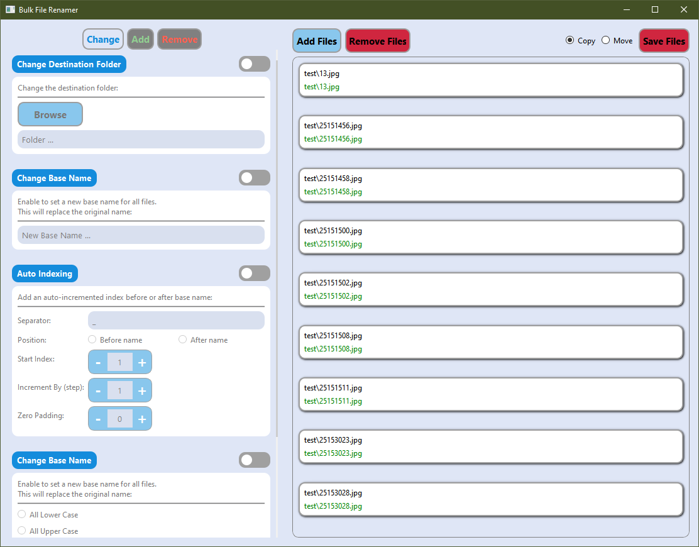
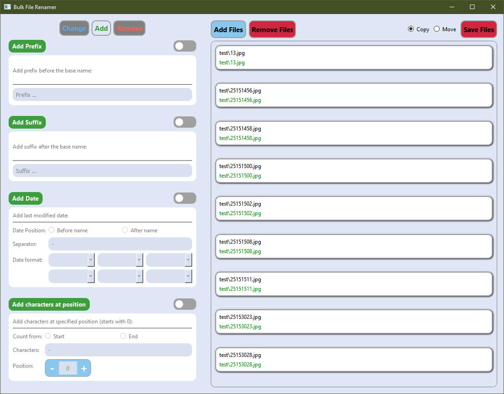
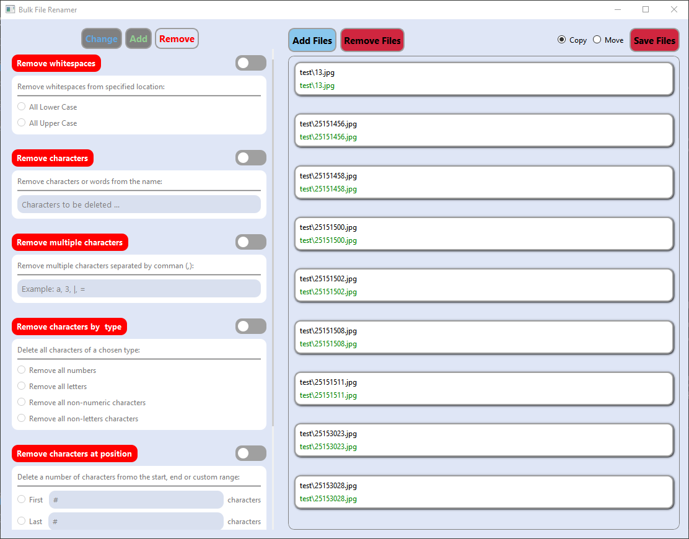

**Mentor -> @prmpsmart**

# **Bulk File Renamer**
A bulk file renamer project with the following features. All these features may be used at the same time or not.

## **0. Destination**
- Specify the destination directory.

## **1. Change base name**
Set a new base name for all the files. This will replace the original base names.

## **2. Auto-indexing**
Add an auto-incremented index before or after the base name of the files.
- Specify separator between the base name and the index e.g "-" in the case of "image-001".
- Specify the position (before, after).
- Specify the start index.
- Specify the step value.
- Specify the zero padding e.g if zero padding is 2, the indexing is 1 the value is 01, if padding is 4 and value is 234 then resulting value is 0234.

## **3. Capitalization**
Change the capitalization of the entire name.
- All Lower Case.
- All Upper Case.
- Sentence Case.

## **4. Change extension**
Change the extension of the files.

## **5. Add prefix**
Add prefix before the base name.

## **6. Add suffix**
Add suffix affer the base name.

## **7. Add date**
Add last modified date.
- Specify the date position.
- Specify separator between the base name and the date.
- Specify date format with six possible values (year, month, day, hour, minute, second). All or some may be included.

## **8. Add characters at position**
Add characters at specified position (starts with 0).
- Specify the characters to add.
- Specify the position to start counting from (start, end).
- Specify the position to add the characters.

## **9. Trim whitespaces**
Remove whitespaces from specified positions. Two options.
- Remove whitespaces from start and end.
- Remove all whitespaces.

## **10. Remove characters**
Remove characters or words from the name.

## **11. Remove multiple characters**
Remove multiple characters or words from the base name at once.

## **12. Remove characters by type**
Remove all characters of a chosen type.
- Remove all numbers.
- Remove all letters.
- Remove all non-numerics.
- Remove all non-letters.

## **13. Remove characters at position**
Remove a number of character from the start, end or custom range.
- Specify the first number of characters to remove.
- Specify the last number of characters to remove.
- Specify the range of characters to remove e.g from the 5th to 9th character.

## **14. Replace characters**
Replace characters or words.
- Specify the characters or word to replace.
- Specify the characters to use in replacements.

